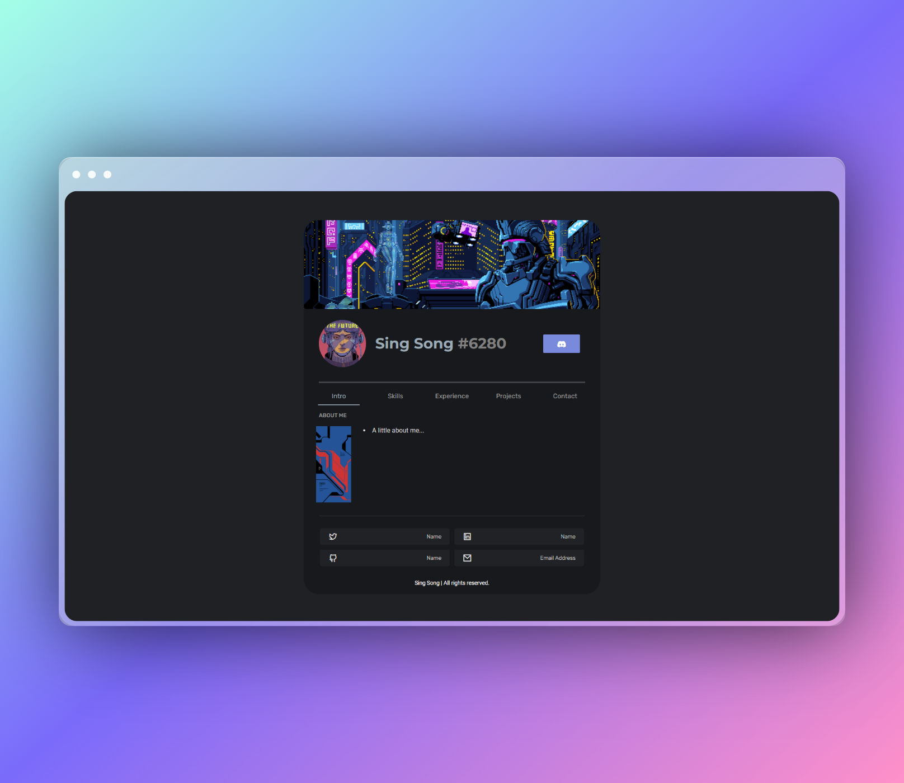
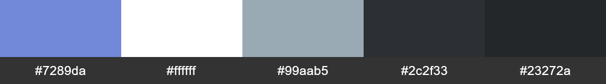

<div align="center">

<h1>Portoflio-Card</h1>

<h6>A Simple Card Style Static Wbsite Template with Discord Theme</h6>

<a href="https://portfolio-card-sang-buster.vercel.app/" _target="blank">

</a>

[](https://portfolio-card-sang-buster.vercel.app/)

---

<p>Discord Color Palette</p>



<h3>🚀 Set-up</h3>

</div>

Clone this repository to a location of your choice

```bash
git clone https://github.com/Sang-Buster/Portfolio-Card.git && cd Portfolio-Card && cd src
```
Then use any tools you wish to open/edit `index.html` and enjoy!
